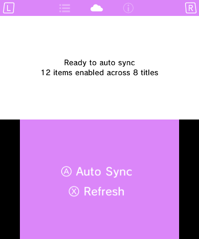
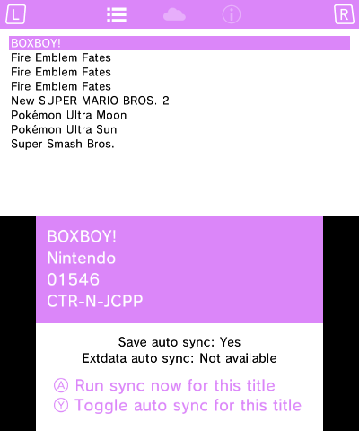

# Cloudpoint

> Bringing modern cloud save to 3DS!

Cloudpoint allows you to sync all of your saves (and extdata) between all of your 3DS & 2DS devices, 
via a central server. Transfer progress between consoles effortlessly, the way you're probably used 
to from more modern systems. Or PS Vita.

## Installing

- Cloudpoint will soon be available on Universal Updater, which is the best way to install it and keep it up to date.
- Or, download the [latest release](https://github.com/dwalker109/cloudpoint/releases/latest) manually.

## Warranty, Support & License

*No warranty is offered or implied*. Great care has been taken to avoid data loss but you must
keep backups of important saves yourself. 

Please join the [Discord](https://discord.gg/DTujASJyg) and help me build a community. 
Please report and technical issues over there, including bugs, crashes and incompatibilities with specific games. 

MIT licensed.

## Quickstart

### If you have one console

1. Run Cloudpoint on your first console (console 1) - it will scan for saves and enable them for auto sync.
1. Press **A** to sync and wait for the progress bar to complete. 
1. You are synced! Take your user key to a new console or run Cloudpoint again after formatting 
   your system to restore saves and extdata.

### If you have additional consoles

1. On console 1, press **R** to reach the *Link* screen and press **X** to share your user key.
1. Run Cloudpoint on another console (console 2) - it will scan for saves and enable them for auto sync. 
1. Press **R** to reach the *Link* screen and press **Y** to receive your key from the first console.
   Follow the onscreen prompts on both consoles; Cloudpoint will restart on completion.
1. Once Cloudpoint reloads, press **A** to sync and expect to be asked to resolve conflicts for any game
  You have installed on both consoles. You will usually see this screen *the first time* you sync a
  game on a given console, or if you progress in a game on *multiple consoles without syncing*.
1. You are synced! You are now free to use a N3DSXL at home and a N3DS on the go; no more compromise!

## Best Practice

- **Keep save backups yourself**. Do this from time to time. Bugs happen and I don't want you to lose
  your 1000 hour Pokémon saves.
- Make a backup of your *user.key* from `/3ds/Cloudpoint/user.key` (you will need this in the event
  you lose your console or memory card, there is no other way to recover your saves).
- Auto sync when you pick up your console for a play session, auto sync again when you finish. This
  will avoid any need to resolve conflicts.
- Use the same version of a game on all your consoles. Syncing saves to different versions may lead to
  data loss, so avoid this. 

## FAQ

Q | A
--- | ---
I can't see my game in Cloudpoint - where is it? | Make sure you have run a game at least once to initialise the save, and then press (X) to refresh in Cloudpoint - it should then appear.
What systems are supported? | All 3DS and 2DS variants. performance is pretty good on all of them.
Do I *have* to auto sync all my games? I have a lot... | No. Saves and/or extdata for a game can be disabled from the Titles screen (press **L** to view it, then press **Y** to toggle). Disabling auto sync for titles you aren't currently playing will speed auto sync up a great deal. You can still sync any title manually by highlighting it and pressing **A**.
Can I self host Cloudpoint? | Yes, easily. See its [README.md](./cloudpoint_server/README.md) for setup steps.
I accidentally downloaded an old save over a newer one! Help! | By default, a backup will be made of any local save before it is replaced. You can use [Checkpoint](https://github.com/BernardoGiordano/Checkpoint) to restore them manually. Either copy the backup to restore into the location Checkpoint expects (and it will then show up there) or add the backup folder to Checkpoint via its config file.

## Limitations

Cloudpoint can't run in the background, and it can't automatically run when you launch a game. This
isn't something which 3DS can natively support, so you will need to manually run syncs (see *best practice*).

3DS doesn't provide a method for knowing when a save was last modified, so we can't show that in
the UI. We *do* know when you last synced a save, so we use that in the UI instead.

## Roadmap

- Time travel; move between server save versions at your leisure.
- Android client for all you emulation fans.

## Credits

- [devkitPro](https://devkitpro.org/) make all of this possible
- [Rust3DS](https://github.com/rust3ds) package it all up so I can actually use it
